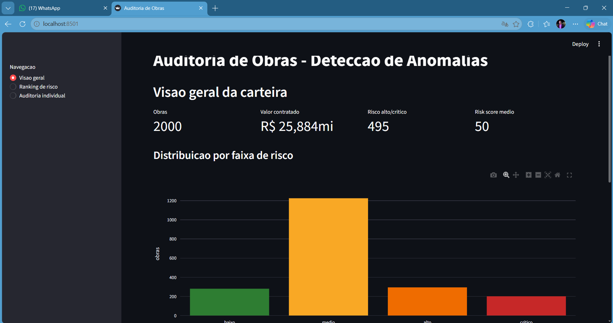
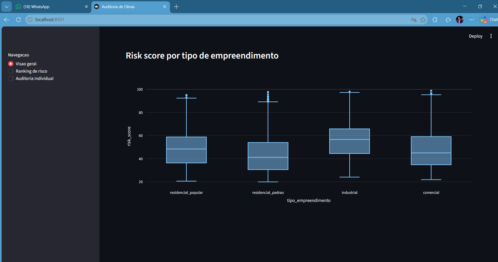
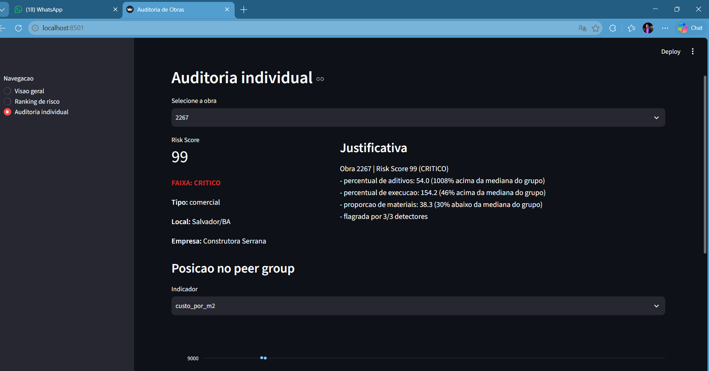
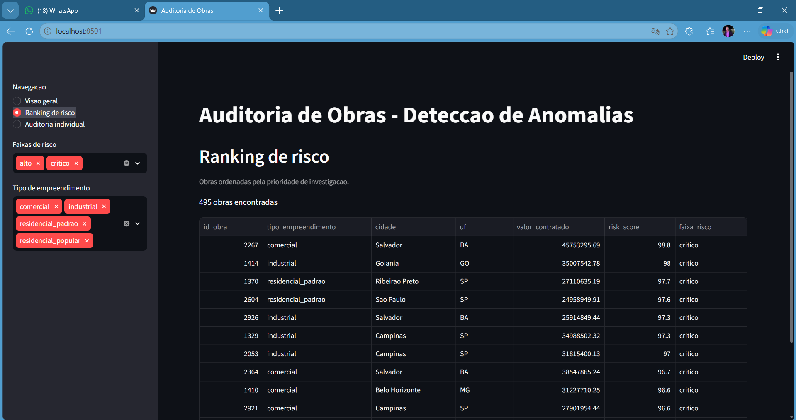

# Auditoria de Obras: Detecção de Anomalias

Imagina que você trabalha na auditoria de uma construtora grande e precisa conferir se as obras estão dentro do esperado: se o custo faz sentido, se o prazo bateu, se os aditivos não fugiram do razoável. O problema é que são milhares de obras e a equipe é pequena. Não dá para olhar uma por uma. Na prática, a auditoria acaba conferindo só uma amostra pequena e torcendo para que os problemas estejam nela.

Este projeto resolve isso. Ele lê a carteira inteira de obras, analisa cada uma e devolve uma lista de prioridade: estas aqui são as que você deveria olhar primeiro, e aqui está o motivo de cada uma. Em vez de auditar no escuro, a equipe passa a focar onde a chance de encontrar problema é maior.

O número que resume o resultado: olhando apenas as 10% de obras marcadas como risco crítico, a equipe encontra todas as obras problemáticas da base. E a cada dez obras dessa faixa que ela investiga, seis realmente têm algo errado. Uma amostragem aleatória das mesmas 10% acharia só um punhado.



## Como o sistema decide o que é suspeito

A lógica toda gira em torno de uma ideia simples: comparar cada obra com obras parecidas.

Não faz sentido comparar uma obra industrial com uma casa popular. A industrial custa mais por metro quadrado por natureza, e isso não quer dizer que tem algo errado. Então o sistema separa as obras por tipo e compara cada uma só com as do seu próprio grupo. É como comparar o preço de um apartamento com outros apartamentos do mesmo bairro, não com casas de campo.



A partir daí, o sistema procura obras que fogem do padrão do grupo de três formas diferentes, porque cada uma pega um tipo de problema:

A primeira olha indicador por indicador e marca quando um valor está longe do normal do grupo. Custo por metro quadrado muito acima da média, prazo que estourou, aditivos exagerados. É a checagem mais direta.

A segunda procura combinações estranhas. Às vezes uma obra não tem nenhum número gritante sozinho, mas a mistura é improvável: custo um pouco alto, produtividade um pouco baixa e muitos fornecedores ao mesmo tempo. Nenhum sinal isolado chamaria atenção, o conjunto sim.

A terceira compara cada obra com as vizinhas mais próximas dela, procurando pontos que ficaram isolados no meio do conjunto.

No fim, o sistema junta os três olhares em uma nota única de 0 a 100, o Risk Score, e separa as obras em quatro faixas: baixo, médio, alto e crítico. Quanto mais alta a nota, mais prioritária a investigação.

## Cada alerta vem com explicação

Um ponto que fez diferença no projeto: não basta dizer que uma obra é suspeita, é preciso dizer por quê. Um auditor não vai investigar um alerta que ele não entende.

Então cada obra vem com uma justificativa em texto, do tipo:

```
Obra 2267 | Risk Score 99 (crítico)
- percentual de aditivos: 54% (muito acima da mediana do grupo)
- percentual de execução: 154% (acima do contratado)
- flagrada pelos três métodos de detecção
```

Isso transforma um número frio em algo acionável. O auditor lê e já sabe por onde começar.



## O painel

Tudo isso fica acessível em um painel visual com três telas: uma visão geral da carteira, um ranking com as obras ordenadas por prioridade (com filtros por tipo e faixa de risco), e uma tela de auditoria individual onde você seleciona uma obra e vê a nota, a justificativa e a posição dela em relação às obras parecidas.



## Sobre os dados

As obras usadas aqui são fictícias, criadas por código. Isso foi uma escolha, não uma limitação: ao gerar os dados, dá para plantar problemas de propósito e guardar em segredo quais obras têm defeito. Depois, é só conferir se o sistema conseguiu achar esses problemas sozinho. É a forma de provar que o método funciona, e não só de afirmar que funciona.

Nesse teste, os três métodos de detecção acertam entre 88% e 100% dos casos plantados, e quando os três concordam sobre uma obra, ela é problema de verdade em 96% das vezes.

## Como rodar

Precisa de Python 3.10 ou mais novo.

```bash
git clone https://github.com/gustavogomes-dv/auditoria-obras-anomalias.git
cd auditoria-obras-anomalias

python -m venv .venv
source .venv/Scripts/activate    # Windows (Git Bash)
# source .venv/bin/activate      # Linux ou Mac

pip install -r requirements.txt

python main.py           # processa todos os dados
streamlit run app.py     # abre o painel no navegador
```

Os dados já vêm prontos no repositório, então o painel abre direto. Rodar `python main.py` refaz tudo do zero.

## Organização do projeto

```
auditoria-obras-anomalias/
├── data/               dados brutos e processados
├── notebooks/          análise passo a passo, do exploratório à detecção
├── src/                o código do sistema, dividido por etapa
│   ├── gerar_dados.py  cria as obras fictícias
│   ├── features.py     calcula os indicadores
│   ├── detectores.py   os três métodos de detecção
│   ├── risk_score.py   junta tudo na nota final
│   └── explicar.py     gera a justificativa de cada obra
├── main.py             roda o processo inteiro de uma vez
├── app.py              o painel visual
└── config.yaml         onde os pesos e faixas podem ser ajustados
```

## Ferramentas

Python, pandas, scikit-learn, SHAP, Plotly e Streamlit.
